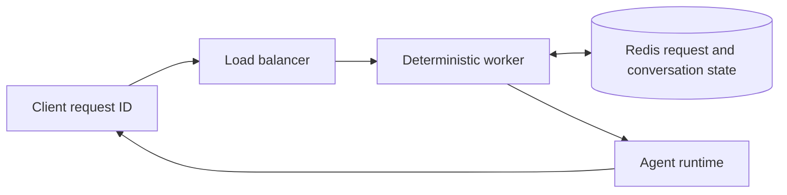

# Distributed agent runtime lab

A local-first reference for an idempotent agent runtime. It ships a React test chat, a deterministic runtime, and a Compose profile with Redis. Repeated request IDs return the first completed result.



## What the current proof covers

The deterministic runtime tests cover completed-request replay, least-load selection, failure requeue, concurrent duplicate suppression, and a conversation checkpoint. The React interface exposes request and conversation IDs, worker assignment, attempts, and replay state. The Compose profile starts the interface and Redis without a cloud account.

```powershell
python -m unittest discover -s tests -v
npm --prefix frontend ci
npm --prefix frontend run build
docker compose up --build --detach
```

Open `http://localhost:8080`. Submit a message, retain the generated request ID, then submit a different message with that same ID. The interface returns the first completed response and marks it as a replay. The [dated Compose evidence](docs/evidence/compose-runtime-ui-2026-09-24.md) records the successful local run.

The same local API exposes `POST /api/messages`, `GET /api/requests/{request_id}`, and `GET /api/conversations/{conversation_id}`. These endpoints provide a small inspection surface for the deterministic demo; they do not expose authentication, tenancy, or production administration.

Stop the local profile when finished:

```powershell
docker compose down
```

## Local conversation demo

Run the standard-library web surface, then open `http://localhost:8080`.

```powershell
python -m runtime_lab.web
```

Run `npm --prefix frontend run dev` in a second terminal to iterate on the React, TypeScript, Tailwind, and shadcn-style interface. Vite proxies API requests to the Python service on port 8080. The Compose image builds the same frontend bundle in a Node stage and serves it from the Python service.

The standalone Python command keeps state in process. Docker Compose sets `REDIS_URL`, so Redis owns request completion and conversation checkpoints in that profile. A local restart proof confirms that a recreated runtime container returns the original completed result from Redis. The implementation does not yet provide Redis Streams dispatch, consumer groups, worker recovery, or multi-replica queue scheduling.

The Docker Compose file provides a Redis service and a runtime container contract. The Kubernetes manifest starts two worker replicas. The GKE Terraform configuration provisions a regional cluster and worker pool; a deployer supplies credentials, project ID, networking review, and immutable image tag. Read [the GKE deployment contract](docs/gke-deployment.md) before planning cloud resources.

## Cloud and Kubernetes boundary

Docker Compose passed locally on 2026-09-24. This workspace has no Kubernetes context or cloud account, so the project has no cluster evidence and makes no claim about an active cloud cluster. A cloud exercise requires a reviewed AWS or GCP plan, an immutable image digest, secret delivery outside Git, and a multi-worker resilience run in the selected environment.

## Article draft

[Idempotency before autoscaling an agent runtime](articles/idempotency-before-autoscaling.md) and its [claim-to-evidence map](articles/claim-map.md) are Markdown drafts for later manual publication.
