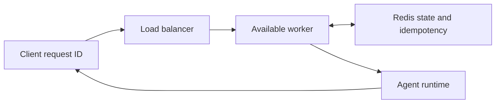

# Distributed agent runtime lab

A local-first reference for an idempotent agent runtime. Requests enter through a load-balanced service, workers claim work, Redis holds shared state in a deployment, and a completed request returns the same response for repeated request IDs.



## Verified local behavior

The deterministic runtime tests prove three state transitions: a repeated completed request returns its original response; a new request selects the least-loaded worker; and a failed worker attempt requeues the request so a later worker can complete it.

```powershell
python -m unittest discover -s tests -v
docker compose config
terraform -chdir=infra\terraform fmt -check
terraform -chdir=infra\terraform validate
kubectl apply --dry-run=client --validate=false -f k8s\runtime.yaml
```

The Docker Compose file provides a Redis service and a runtime container contract. The Kubernetes manifest starts two worker replicas. The GKE Terraform configuration provisions a regional cluster and worker pool; a deployer supplies credentials, project ID, networking review, and immutable image tag. Read [the GKE deployment contract](docs/gke-deployment.md) before planning cloud resources.

## Operational boundary

Docker Desktop and a Kubernetes context are not running on this host at the current validation time, so container and cluster execution remain unverified. The repository does not claim an active cloud cluster. Before a cloud deployment, validate infrastructure modules in the target AWS or GCP account, pin the image digest, configure secret delivery outside Git, and run a multi-worker resilience test.

## Article draft

[Idempotency before autoscaling an agent runtime](articles/idempotency-before-autoscaling.md) and its [claim-to-evidence map](articles/claim-map.md) are Markdown drafts for later manual publication.
