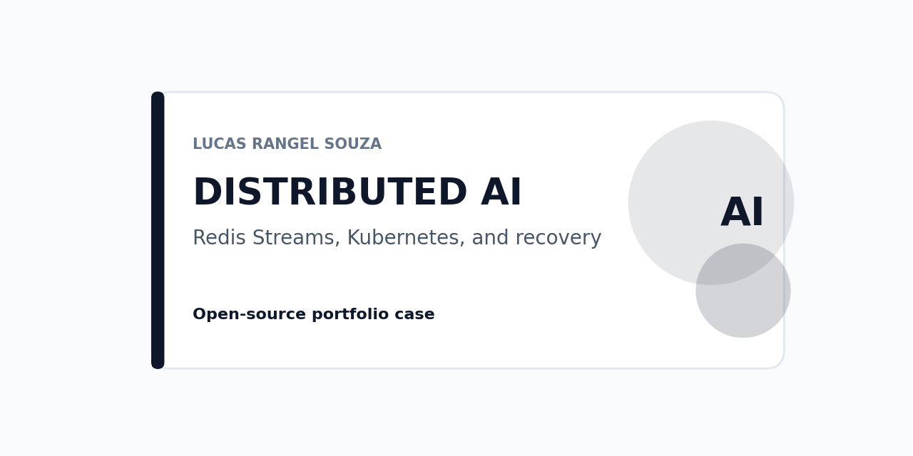
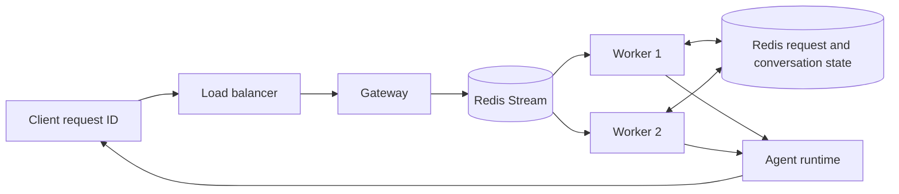

# Distributed agent runtime lab



A local-first reference for an idempotent agent runtime. It ships a React test chat, a deterministic runtime, and a Compose profile with Redis. Repeated request IDs return the first completed result.



## What the current proof covers

The deterministic runtime tests cover completed-request replay, least-load selection, failure requeue, concurrent duplicate suppression, a conversation checkpoint, and one Redis Streams worker cycle. The React interface exposes request and conversation IDs, worker assignment, attempts, and replay state. The Compose profile starts the interface, Redis, and two stream consumers without a cloud account.

```powershell
python -m pip install -e .
npm --prefix frontend ci
make check
docker compose up --build --detach
```

Open `http://localhost:8080`. Submit a message, retain the generated request ID, then submit a different message with that same ID. The interface returns the first completed response and marks it as a replay. The [dated Compose evidence](docs/evidence/compose-runtime-ui-2026-09-24.md) records the successful local run.

The same local API exposes `POST /api/messages`, `GET /api/requests/{request_id}`, and `GET /api/conversations/{conversation_id}`. These endpoints provide a small inspection surface for the deterministic demo; they do not expose authentication, tenancy, or production administration.

Stop the local profile when finished:

```powershell
docker compose down
```

## Local conversation demo

Run the standard-library web surface, then open `http://localhost:8080`.

```powershell
python -m runtime_lab.web
```

Run `npm --prefix frontend run dev` in a second terminal to iterate on the React, TypeScript, Tailwind, and shadcn-style interface. Vite proxies API requests to the Python service on port 8080. The Compose image builds the same frontend bundle in a Node stage and serves it from the Python service.

The standalone Python command keeps state in process. Docker Compose sets `REDIS_URL`, so Redis owns request completion and conversation checkpoints in that profile. The gateway atomically creates a request state record, enqueues it in `runtime-lab:agent-runs`, and polls briefly for a stream worker result. The `agent-workers` consumer group acknowledges an entry only after it persists the completed state. A duplicate request ID returns the persisted result and never enqueues a second run.

A local Compose proof started two worker containers, processed a stream entry with one worker, showed two consumers in the group, and confirmed zero pending messages. That is a functional dispatch proof, not a worker-crash recovery or throughput benchmark.

## Reproduce worker recovery

The deterministic reference worker accepts `PROCESSING_DELAY_MS` only to make an interruption observable in a local test. It is not a production latency control. The following PowerShell session starts one deliberately delayed worker, sends a request, stops that worker while the entry is pending, and starts a replacement that claims the pending entry after its idle threshold.

```powershell
$env:PROCESSING_DELAY_MS = "3000"
docker compose up --build --detach --force-recreate --scale worker=1
Remove-Item Env:PROCESSING_DELAY_MS

# In a second terminal, post a unique request to /api/messages.
# Before three seconds elapse, run:
docker compose kill worker
docker compose up --detach --force-recreate --no-deps --scale worker=1 worker
```

Inspect the request by ID until it reaches `completed`, then restore the regular profile with `docker compose up --detach --scale worker=2 worker`. The replacement should become the recorded worker, while Redis reports no pending entry. This proves a pending-entry reclaim under the local deterministic workload; it does not quantify recovery time or establish fault tolerance outside this Compose topology.

The Docker Compose file provides a Redis service and a runtime container contract. The Kubernetes manifest starts two worker replicas. The Terraform blueprints define separate primary and secondary managed clusters for GCP and AWS. A deployer supplies credentials, project ID or AWS account context, networking review, and an immutable image tag. Read [the cloud deployer identity contract](docs/cloud-deployer-identity.md) and [the GKE deployment contract](docs/gke-deployment.md) before planning cloud resources.

## Cloud and Kubernetes boundary

Docker Compose passed locally on 2026-09-24. A worker interruption and pending-entry reclaim also passed in the Compose profile on that date. The `kind` profile then passed a local Kubernetes run on this host: one gateway, Redis, and two Redis Streams workers reached readiness across two worker nodes. The [dated kind evidence](docs/evidence/kind-bootstrap-attempt-2026-09-24.md) covers an API smoke request and replay, scale-down and scale-up, controlled worker replacement, and Redis-backed conversation continuity. The [reproduction guide](docs/kind-reproduction.md) documents the pinned compatible node image and commands. This is local cluster evidence only; it does not measure throughput, validate HPA or KEDA behavior, or establish an active cloud cluster. A cloud exercise requires a reviewed AWS or GCP plan, an immutable image digest, federated or short-lived deployer credentials, secret delivery outside Git, and a multi-worker resilience run in the selected environment.

The Helm chart at `helm/agent-runtime` separates gateway, worker, and Redis workloads. It includes probes, resource limits, a worker disruption budget, a restrictive demonstration NetworkPolicy, a CPU-based HPA, and an optional Redis Streams KEDA trigger. KEDA stays disabled by default because its CRD and operator are not part of a fresh Kubernetes cluster. Supply an existing Secret name only through `secrets.existingSecret`; the chart never generates credentials.

## Local benchmark

The [dated Compose benchmark](docs/evidence/compose-benchmark-2026-09-24.md) sent 48 unique requests at concurrency six through the local gateway and two Redis Streams workers. It recorded 61.89 requests/s, p50 latency of 56.88 ms, p95 latency of 147.95 ms, zero errors, and zero queue lag at the end of that run. Those figures describe one deterministic-stub workload on one Docker Desktop host. They are not a production capacity claim.

## Public-demo profile

`deploy/public-demo/` is a separate, opt-in Compose profile that composes this repository's own runtime with pinned artifacts from `brazil-public-data-map` (the real, published education Kaggle release) and `education-finance-mlops`/`brazil-public-data-map` (two paused example Airflow DAGs). It is a deployment demonstration, not a production SaaS: nginx is the only published service, every other service sits on an internal network, and a dedicated egress proxy is the only route out, restricted to an allowlist that denies localhost, private ranges, and cloud-metadata addresses.

```powershell
python scripts/public_demo_env.py
bash scripts/public_demo_cert.sh
bash scripts/public_demo_load_release.py --release-dir <extracted lucasrangelss/brazil-education-data-lake v1>
bash scripts/public_demo.sh up -d --build
bash scripts/public_demo.sh --profile seed run --rm metabase-seed
python scripts/check_public_demo_policy.py --strict-release
```

The [2026-09-25 acceptance run](docs/evidence/public-demo-local-2026-09-25.md) recorded: only ports 80/443 reachable; the internal network cannot reach the internet or cloud metadata while the egress proxy reaches only its allowlist; Metabase serves one approved public dashboard over the real, hash-verified 27,830-row education release and blocks `/admin`, `/question`, and the API routes; both mounted Airflow DAGs load paused with no schedule reachable through nginx; a restarted application container returns to healthy without host intervention. The [compatibility matrix](deploy/public-demo/compatibility-matrix.md) records what is pinned by digest versus still a local build (the RAG gateway is currently a documented fixture stand-in, not the real `ai-platform-rag-observability` image, which has no registry publish yet). The [runbook](docs/public-demo-runbook.md) covers image updates, rollback, secret rotation, public-link revocation, backup/restore, and teardown.

A real VPS, domain, and DNS deployment does not exist and is out of scope here (spec section 14.2): it requires a provider, a domain, and a management-access method, decided in a separate private infrastructure repository after its own host-exposure review.

## Delivery boundary

CI verifies source, local interface behavior, container construction, Helm, manifests, and Terraform syntax. A later, unused `v*` tag triggers the [release delivery workflow](docs/release-delivery.md), which publishes a GHCR image with an SBOM and provenance. The existing `v0.1.0` source release predates that workflow and has no corresponding container artifact. No release workflow provisions cloud resources.

```powershell
docker run --rm -v "${PWD}:/work:ro" alpine/helm:3.16.4 lint /work/helm/agent-runtime
docker run --rm -v "${PWD}:/work:ro" alpine/helm:3.16.4 template runtime-lab /work/helm/agent-runtime
```

## Article draft

[Idempotency before autoscaling an agent runtime](articles/idempotency-before-autoscaling.md) and its [claim-to-evidence map](articles/claim-map.md) are Markdown drafts for later manual publication.
