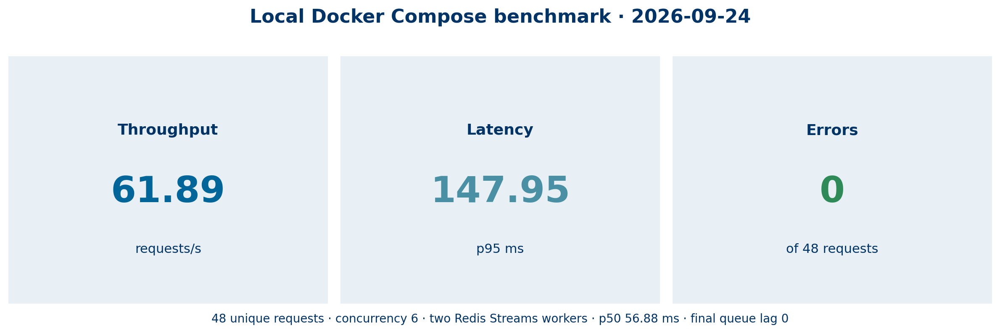

# Local Docker Compose benchmark



## Method

On 2026-09-24, the local Docker Compose profile ran Redis, one gateway, and two Redis Streams workers. The benchmark posted 48 unique request IDs to `POST /api/messages` at concurrency six. It measured client-observed elapsed time for every request. A completed result with `cache_hit: false` counted as a success.

The command inspected `XINFO GROUPS runtime-lab:agent-runs` after the requests completed. The group reported zero pending messages and zero lag. Workers completed 24 requests each.

## Results

| Measure | Recorded value |
|---|---:|
| Unique requests | 48 |
| Concurrency | 6 |
| Completed | 48 |
| Errors | 0 |
| Elapsed wall time | 0.78 s |
| Throughput | 61.89 requests/s |
| p50 latency | 56.88 ms |
| p95 latency | 147.95 ms |
| Final Redis Streams pending | 0 |
| Final Redis Streams lag | 0 |

## Scope limit

This is one deterministic-stub workload on one local Docker Desktop host. It measures the complete local request path, including HTTP, Redis Streams dispatch, worker completion, and gateway polling. It does not estimate production capacity, model-provider latency, saturation behavior, autoscaling, or a Kubernetes and cloud deployment.

## Reproduce

Start the Compose profile, then run the benchmark script. Its JSON output contains the run ID, success count, latency percentiles, throughput, worker distribution, and any failures.

```powershell
docker compose up --build --detach
.\scripts\run_compose_benchmark.ps1 -RequestCount 48 -Concurrency 6
docker compose exec -T redis redis-cli XINFO GROUPS runtime-lab:agent-runs
```

`scripts/generate_compose_benchmark_chart.py` renders the checked-in chart from the recorded values. Run a fresh benchmark before replacing those values or presenting the chart as current evidence.
